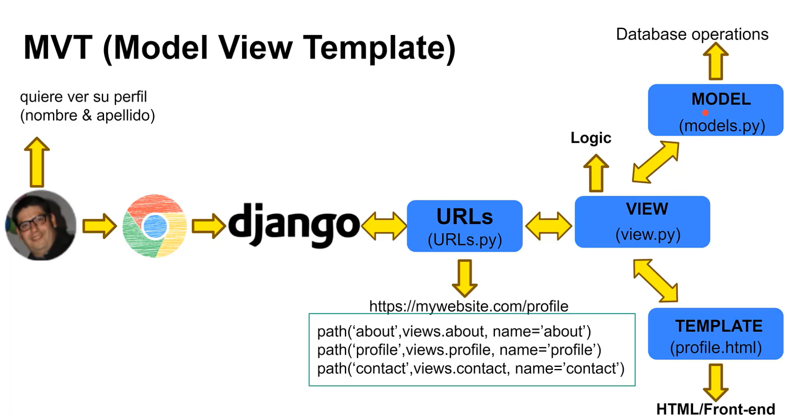

# inmuebles-django - Vaxi Drez

# Python
Show list version python
```python
py --list
```

# Update pip
```python
python -m pip install --upgrade pip
```

# -----------------------------------------------------------------

# Create virtual environment
### 1. Install virtualenv
```python
python -m pip install virtualenv

py -V:3.12 -m pip install virtualenv        # Install for specific version
```

## Quick start
Create the environment (creates a folder in your current directory)

### 2. Create virtual environment (`cd name_project`)
`venv` y `virtualenv` crean entornos de Python aislados para gestionar dependencias de proyectos. Venv viene integrado en Python 3.3+, siendo la opción estándar y recomendada para la mayoría de usos modernos. Virtualenv es una herramienta de terceros más rápida, flexible y compatible con Python 2, ideal para necesidades complejas. 

```python
python -m venv name_project-env                     # Compatible solo con Python 3

python -m virtualenv name_project-env               # Compatible con Python 2 y 3, más rápido y flexible

py -2 -m virtualenv env_name

py -3.14 -m virtualenv env_name

py -3.12 -m virtualenv virtualenv
```

### 3. Activate virtual environment
With cmd: `cd name_project\Scripts\`
#### In Linux or Mac, activate the new python environment
```python
source env_name/bin/activate
```

#### Or in Windows
```python
.\env_name\Scripts\activate
```

### 4. Desactivate virtual environment
```python
deactivate
```

# -----------------------------------------------------------------

# Requirements

### Show installed packages
```python
pip freeze
```

### Save file of requirements
```python
pip freeze > requirements.txt
```

### Install requirements
```python
pip install -r requirements.txt
```

# -----------------------------------------------------------------

# Install Django
```python
python -m pip install Django
pip install Django
pip install Django==2.0.2
```

# Show version Django
```python
python -m django --version
```

# Create a project in Django
```python
django-admin startproject mystore
```

# Create a app in Django
With cmd: `cd mystore\`
```python
python manage.py startapp commentsapp
```
# -----------------------------------------------------------------

# Pattern MVT (MVC)
- Model: It is the data layer. It is responsible for managing the data of the application. It receives and processes the information sent by the controller and responds to requests for information from the view.
- View: It is the presentation layer. It is responsible for displaying the information to the user. It receives the data from the model and formats it for display.
- Template: It is the presentation layer. It is responsible for displaying the information to the user. It receives the data from the model and formats it for display.



# -----------------------------------------------------------------

# Test
### Init tests
```python
python manage.py test
python manage.py testserver
```

# -----------------------------------------------------------------

# Migration
### Create and run migrations
```python
python manage.py makemigrations
python manage.py migrate
```

### Migrate specific application
```python
python manage.py migrate <applicationName>
python manage.py migrate commentsapp
```

### Revert migration
```python
python manage.py migrate <applicationName> <migrationNumber>
python manage.py migrate commentsapp 0001
```

# -----------------------------------------------------------------

# Superuser
### Create superuser and password
```python
python manage.py createsuperuser
python manage.py changepassword
```

# -----------------------------------------------------------------

# Run project
With cmd: `cd mystore\`
```python
python .\manage.py runserver 8081
```

# -----------------------------------------------------------------

# Shell (Interactive console)
```python
python .\manage.py shell
```
